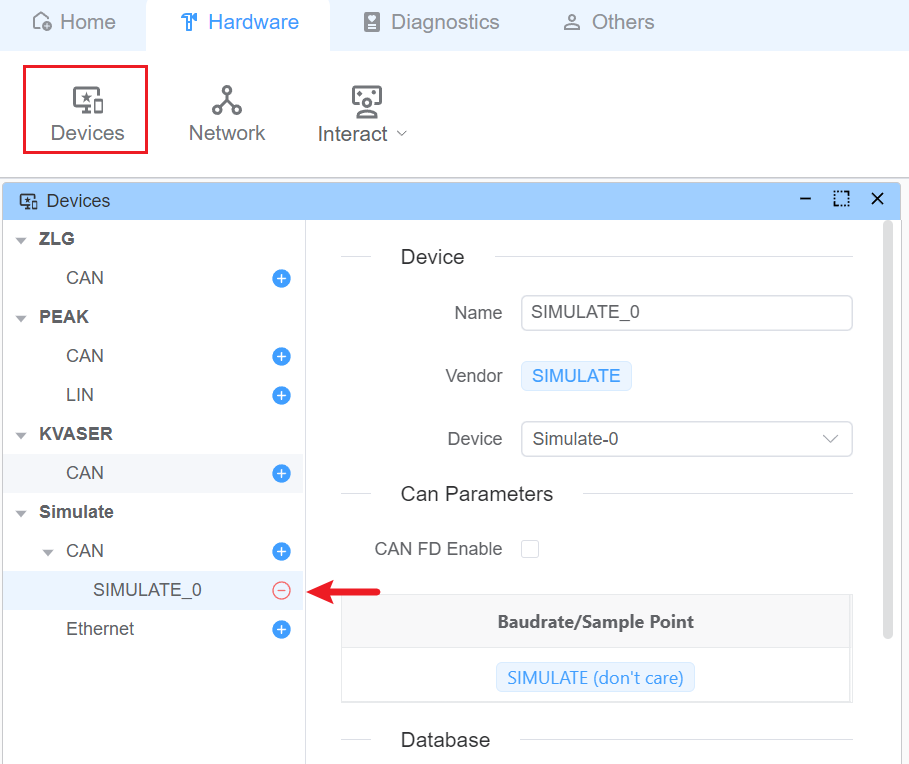
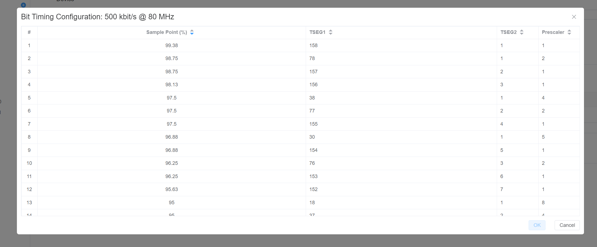
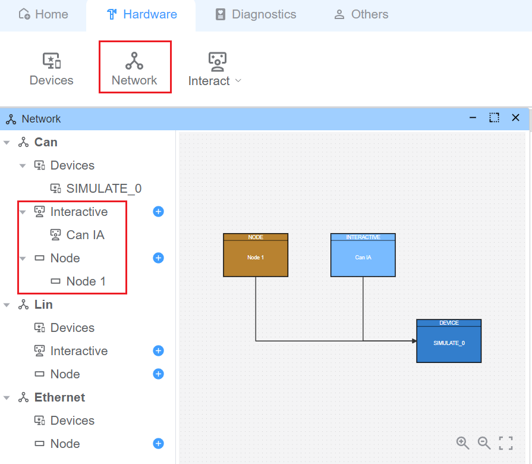
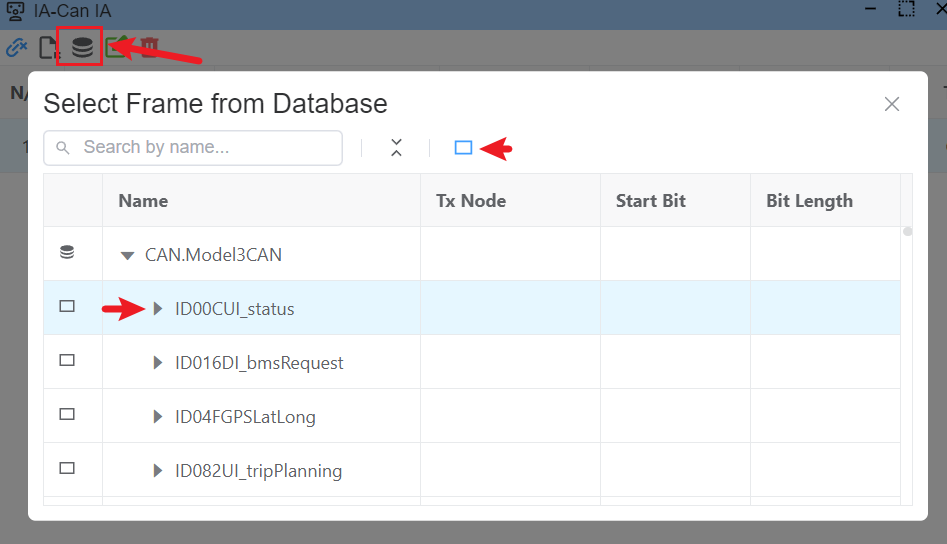
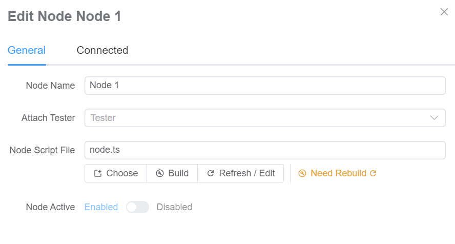

# CAN 总线

CAN/CAN-FD 是一种行业标准的车辆总线协议，专为汽车应用中可靠的 ECU（电子控制单元）通信而设计。

> [!IMPORTANT]
> 本节描述的某些功能可能需要CAN DBC文件。有关DBC文件的更多信息，请参阅我们的 [database documentation](../dbc)。

## 支持的硬件

| 设备制造商 | 支持的协议 |
| ------- | ----------- |
| PEAK    | CAN, CAN-FD |
| KVASER  | CAN, CAN-FD |
| ZLG     | CAN, CAN-FD |
| Toomoss | CAN, CAN-FD |
| VECTOR  | CAN, CAN-FD |
| SLCAN   | CAN, CAN-FD |

## SLCAN 特别说明

SLCAN 是一种低成本的开源解决方案，其固件源自 [canable-fw](https://github.com/normaldotcom/canable-fw)，通信基于 USB-ACM（抽象控制模型）。

> [!NOTE]
> 该固件目前不为串行命令提供任何 ACK/NACK（确认/未确认）反馈。

## GS_USB

基于 usbfs 或 WinUSB WCID 的 Windows/Linux/Mac CAN 驱动程序，适用于 Geschwister Schneider USB/CAN 设备和 candleLight USB CAN 接口。

## 设备配置

出于演示目的，我们将使用一个模拟设备。您可以在设备设置中配置波特率和采样点。



### 波特率设置

波特率设置用于配置 CAN 总线的通信速率。

点击 `Bit Timing`（位时序）按钮打开位时序配置窗口：




## 交互模式与节点脚本

EcuBus-Pro 提供两种主要的 CAN 通信方法：

- **交互模式**：采用手动方式发送报文
- **节点脚本**：使用自定义脚本收发报文



### 交互模式

可以为每个报文配置周期性发送或手动触发（单次触发或按键触发）。


您可以通过两种方式添加报文：

- 手动配置
- 从 DBC 数据库导入



### 节点脚本

节点可以配置 UDS（统一诊断服务）功能（作为测试器）和自定义脚本。



以下是一个用于周期性信号更新的脚本示例：

```typescript
import { setSignal } from 'ECB'
let val = 0
// 每秒更新信号值
setInterval(() => {
  setSignal('Model3CAN.VCLEFT_liftgateLatchRequest', val++ % 5)
}, 1000)
```

## 诊断操作

1. **测试器配置**

   - 配置寻址方式
   - 设置诊断参数
       

2. **诊断服务**

   - 配置诊断服务
   - 创建调度表和序列
    

3. **消息监控**
   - 在跟踪窗口中查看发送和接收的消息
     
