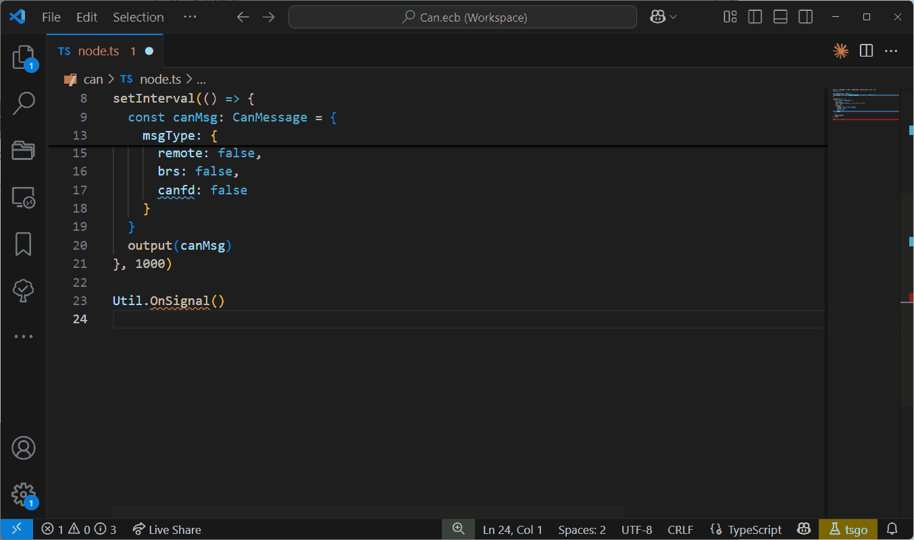

# CAPL转EcuBus-Pro脚本（Typescript）

在汽车电子测试和诊断领域，`CAPL（CANoe Programming Language）`一直是测试自动化脚本开发的重要工具。它在 `Vector CANoe` 生态中有着强大的能力和成熟的用户基础。
然而，随着测试场景的多样化、跨平台需求的增加，以及对更高灵活性和可维护性的追求，是否有其他替代的解决方案呢。

EcuBus-Pro 给出的答案是：使用 `Typescript` 编写脚本。EcuBus-Pro 脚本采用 `TypeScript` 作为开发语言，具备现代软件工程特性。相比 CAPL，`Typescript`提供了更丰富的生态、更强的可扩展性，以及与 DevOps 流程的天然兼容。

## EcuBus-Pro脚本自动提示

> 因为EcuBus-Pro脚本使用TypeScript作为开发语言，所以会根据TypeScript类型进行自动提示

## CAPL vs EcuBus-Pro 脚本语法对比表

> [!INFO]
> 持续完善中，更多脚本API，请参考 [API](https://app.whyengineer.com/scriptApi/index.html)

| 功能             | CAPL 示例                                     | EcuBus-Pro Script 示例 (TypeScript)                       |
| ---------------- | --------------------------------------------- | --------------------------------------------------------- |
| **类型检查**     | 弱类型，编译时不检查                          | 强类型，IDE 提示 + 编译检查                               |
| **库与扩展**     | Vector 环境内置                               | NPM 生态，第三方库丰富                                    |
| **变量声明**     | `int counter = 0;`                            | `let counter: number = 0;`                                |
| **打印日志**     | `write("Hello CAPL");`                        | `console.log("Hello EcuBus-Pro");`                        |
| **消息接收事件** | `on message CAN1.MyMsg{  write("Received");}` | `Util.OnCan(0x1, (msg) => {  console.log("Received");});` |
| **事件回调**     | `on key 'a' { ... }`                          | `Util.OnKey('a', () => { ... });`                         |

## 示例

> 示例持续完善中，欢迎大家一起贡献示例
1. [监听信号的变化，输出时间间隔](./capl2ts1.md)

