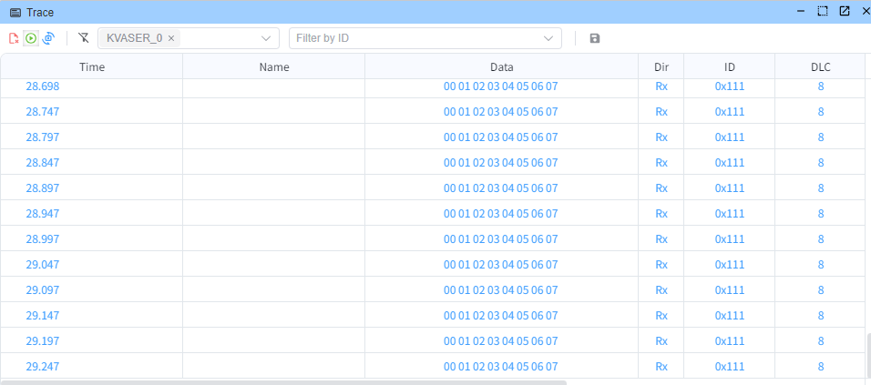

# CAN High-Precision Timer Example

> [!NOTE]
> This example requires a CAN device with hardware timestamp capability to better demonstrate the accuracy of the high-precision timer.
> This demo uses a **KVASER** USB-to-CAN device.

## Overview

Node.js native `setTimeout` and `setInterval` functions have millisecond-level precision, which is not ideal for high-precision timing requirements. This example uses [PrecisionTimer](https://app.whyengineer.com/scriptApi/classes/PrecisionTimer.html) to implement microsecond-level high-precision timing.

## Code Example

```typescript
import { CAN_ID_TYPE, CanMessage, output, PrecisionTimer } from 'ECB'

// Create high-precision timer instance
const timer = new PrecisionTimer('can_timer')
timer.create()

Util.Init(() => {
    // Add scheduled task: send CAN message every 50ms (50000 microseconds)
    timer.addTask(50000, 50000, () => {
        const canMsg: CanMessage = {
            id: 0x111,
            data: Buffer.from([0, 1, 2, 3, 4, 5, 6, 7]),
            dir: 'OUT',
            msgType: {
                idType: CAN_ID_TYPE.STANDARD,
                remote: false,
                brs: false,
                canfd: false
            }
        }
        output(canMsg)
    })
})

Util.End(() => {
    // Clean up timer resources
    timer.destroy()
})
```

## Results



Through hardware timestamps, you can see that the message transmission intervals are very precise, with errors at the microsecond level.
